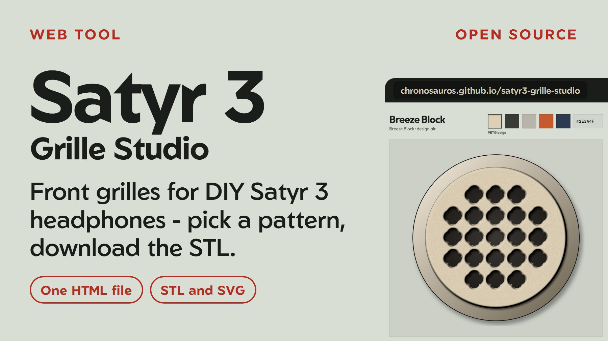
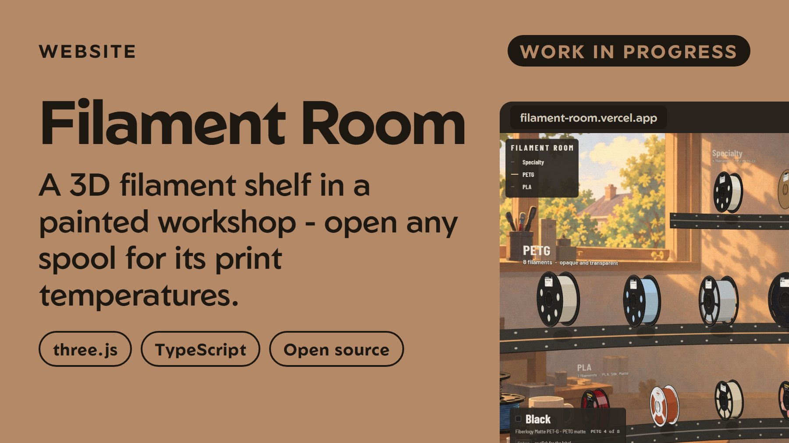
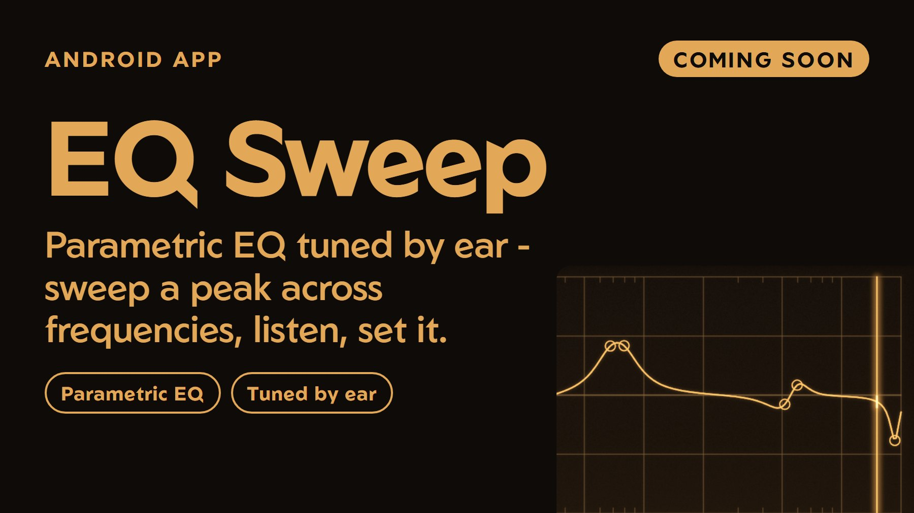

### Chronosaur

I build small, finished tools and sites - each one for a single job, done carefully.
Some are open source, some are only showcased here; the live links always work.

**gamebloom** - [gamebloom.vercel.app](https://gamebloom.vercel.app) · [showcase repo](https://github.com/Chronosauros/gamebloom)

 

**Contour** - [source](https://github.com/Chronosauros/contour) · [download the APK](https://github.com/Chronosauros/contour/releases/latest)

 

**Satyr 3 Grille Studio** - [open in the browser](https://chronosauros.github.io/satyr3-grille-studio/) · [source](https://github.com/Chronosauros/satyr3-grille-studio)

 

**Filament Room** - work in progress - [filament-room.vercel.app](https://filament-room.vercel.app) · [source](https://github.com/Chronosauros/filament-room)

 

**EQ Sweep** - coming soon - [follow on GitHub](https://github.com/Chronosauros/eq-sweep)
