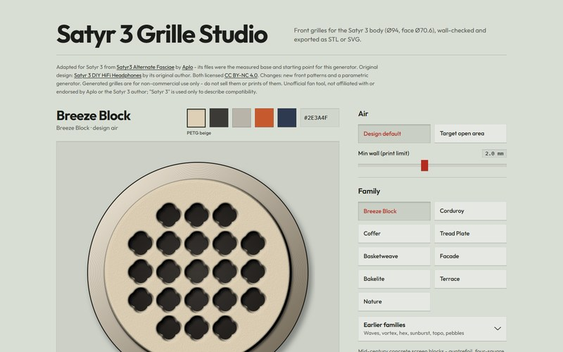

### Chronosaur

I build small, finished tools and sites - each one for a single job, done carefully.
Some are open source, some are only showcased here; the live links always work.

<table>
<tr>
<td width="50%" valign="top">

<h3><a href="https://github.com/Chronosauros/gamebloom">gamebloom</a></h3>
Every new game trailer on one page, and every game from the big showcases indexed one by one, with sourced facts.  
<a href="https://gamebloom.vercel.app">gamebloom.vercel.app</a> · Next.js · showcase
</td>
<td width="50%" valign="top">

<h3><a href="https://github.com/Chronosauros/contour">Contour</a></h3>
On-the-go EQ manager for the CrinEar Protocol Micro: keep EQ profiles on your Android phone and send one to the dongle in seconds.  
<a href="https://github.com/Chronosauros/contour/releases/latest">Download the APK</a> · Kotlin, Compose
</td>
</tr>
<tr>
<td width="50%" valign="top">

<h3><a href="https://github.com/Chronosauros/satyr3-grille-studio">Satyr 3 Grille Studio</a></h3>
Front grille generator for the Satyr 3 DIY headphones: pick a pattern, set the open area, download a print-ready STL or SVG.  
<a href="https://chronosauros.github.io/satyr3-grille-studio/">Open in the browser</a> · one HTML file, open source
</td>
<td width="50%" valign="top">

<h3><a href="https://filament-room.vercel.app">Filament Room</a> work in progress</h3>
A 3D filament shelf in a painted workshop: browse spools by row, open one for a clean product card with material, colour and print temperatures.  
<a href="https://filament-room.vercel.app">filament-room.vercel.app</a> · <a href="https://github.com/Chronosauros/filament-room">source</a> · three.js, TypeScript · open source
</td>
</tr>
</table>
